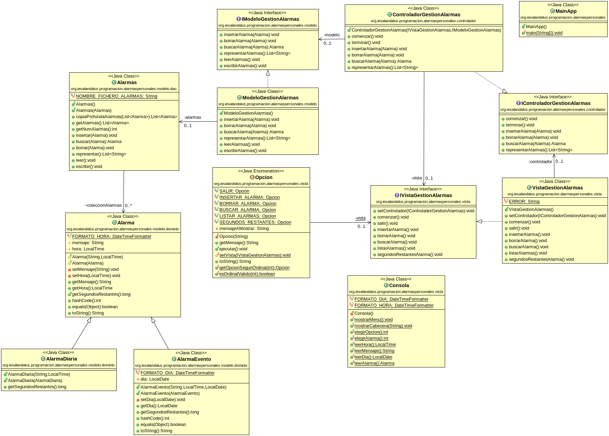

# Gestión de alarmas personales
## José Ramón Jiménez Reyes

Queremos realizar la gestión de nuestras alarmas personales. Una alarma consistirá en un mensaje de texto y un hora a la que nos avisará. Pero también queremos gestionar no sólo alarmas diarías, sino también alarmas de eventos que además de los datos anteriores tendrá un día en el que se nos avisará.

Podremos llevar a cabo una gestión completa de dichas alarmas (insertar, borrar, buscar y listar).

Además queremos que dichas alarmas queden almacenadas en ficheros para que así podamos usarlas una vez terminado nuestro programa.

Además queremos implementar el patrón MVC.

Para ello te propongo el siguiente diagrama de clases.

